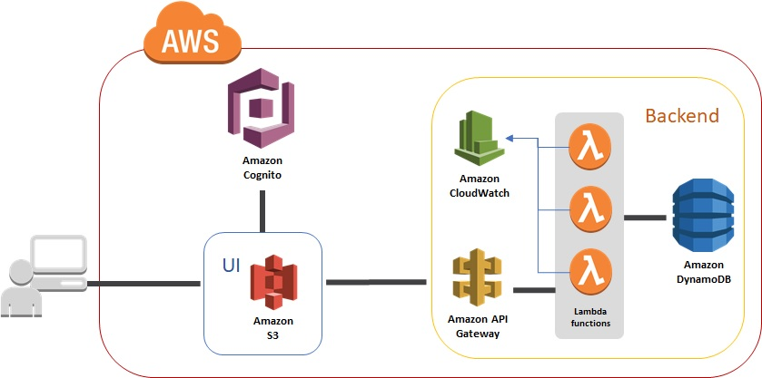

#### Requirements
* 4 APIs for Starbucks app
* UI
* Deployment

#### Design Notes

Serverless design was chosen for the application since there is no component of
the application that needs to be running at all times. Serverless APIs get
executed only when they're called, thus we save on operational cost, thereby we
create cost efficient application.

Deployment of the application will be done on AWS. Therefore, following
components where chosen for system design:
* AWS Lambda - function that will be executed on api calls
* API Gateway - API endpoints that are linked to Lambda functions
* DynamoDB - NoSQL db. Gives us flexibility if schema changes occur
* AWS Cognito - For user authentication
* AWS S3 - Deployement of UI components

#### API Details

